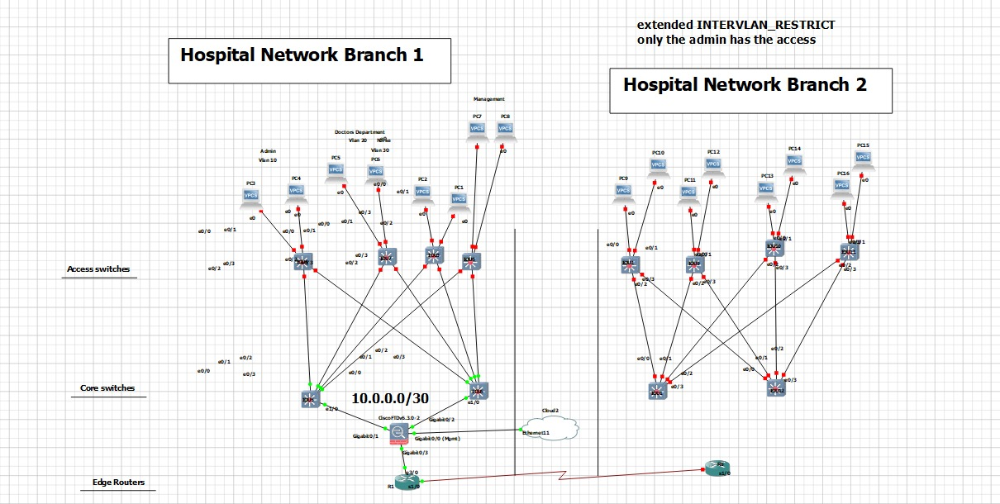
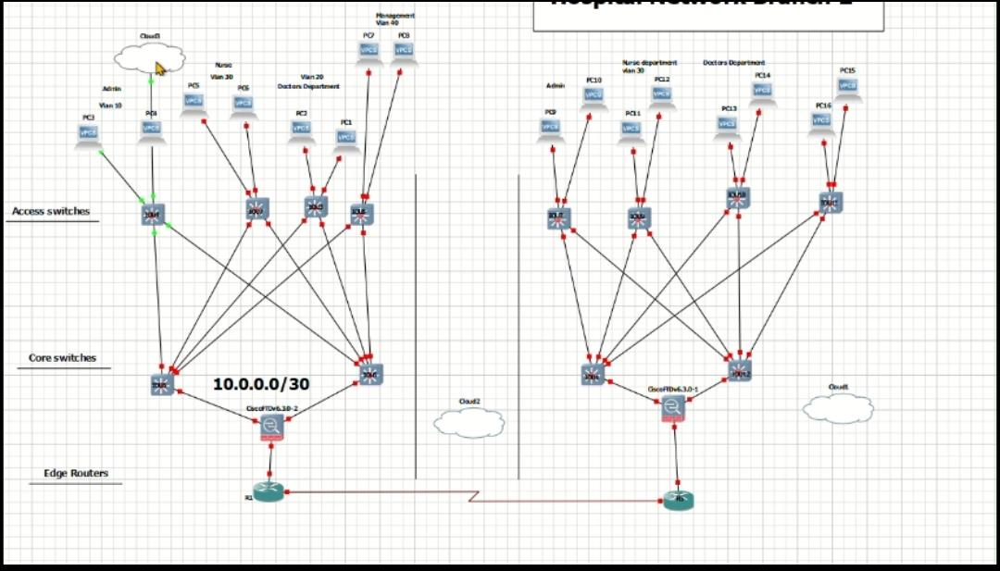

# Secure Hospital Branch Network Simulation (GNS3)

## 🏥 Overview
A redundant, secure, and scalable hospital network architecture designed using GNS3 and Cisco IOU. This project demonstrates advanced routing, high availability, and next-generation firewall implementation, aligned with **CCNP Security** standards. The design includes two branch offices connected via a Cisco Firepower Threat Defense (FTD) firewall, ensuring secure inter-branch communication.

## 📸 Network Topology

### Branch 1 Architecture



### Branche 2 Architecture



## 🛠️ Technologies Used
*   **Routing:** OSPF (Multi-area), HSRP (Gateway Redundancy), Static Routing
*   **Switching:** VLANs, Trunking, STP, Port Security, BPDU Guard, DHCP Snooping
*   **Security:** Cisco FTD (Firepower Threat Defense), ACLs, IPS, Yersinia Attack Simulation
*   **Services:** Windows Server 2021 (DHCP, DNS, Active Directory), SCCM, SQL Always On

##  Network Architecture & Design

### 1. High Availability (Layer 3)
*   **HSRP Implementation:** Core Switches (C-SW1/C-SW2) are configured with HSRP for gateway redundancy.
    *   **Active Gateway:** C-SW1 (Priority 110)
    *   **Standby Gateway:** C-SW2 (Priority 90)
    *   **Virtual IP:** `192.168.x.3` for all VLANs.
    *   **Preempt:** Enabled to ensure role recovery after failure.
*   **OSPF Routing:** Dynamic routing implemented between Edge Routers and Core Switches to ensure path failover.

### 2. Segmentation & Access Control (VLANs)
The network is strictly segmented to isolate critical hospital departments:
*   **VLAN 10 (Admin):** `/29` subnet. **Only Admin VLAN has SSH access** to network devices.
*   **VLAN 20 (Doctors):** `/29` subnet. Access to medical records.
*   **VLAN 30 (Nurses):** `/29` subnet. Limited administrative access.
*   **VLAN 40 (Management):** `/29` subnet. Full network oversight.
*   **Inter-VLAN ACLs:** Applied to restrict ping and traffic between non-admin VLANs, ensuring lateral movement is blocked at Layer 3.

### 3. Layer 2 Security Hardening
*   **Port Security:** Configured on Access Switches with `sticky` MAC addresses and `violation restrict` to prevent unauthorized device connection.
*   **BPDU Guard & PortFast:** Enabled on access ports to prevent STP loops and rogue switch injection.
*   **DHCP Snooping:** Implemented to prevent rogue DHCP server attacks.

### 4. Firewall Integration (Cisco FTD)
*   Positioned between branches to inspect inter-site traffic.
*   **Features Enabled:** Next-Generation Intrusion Prevention System (NGIPS), Advanced Malware Protection (AMP), and URL Filtering.

## 🔒 Security Validation & Penetration Testing
To validate the security posture, the network was subjected to simulated attacks using **Kali Linux (Yersinia, Nmap, Scapy)**:

| Attack Vector | Tool Used | Mitigation Implemented | Result |
| :--- | :--- | :--- | :--- |
| **DHCP Starvation** | Yersinia | DHCP Snooping + Rate Limiting | **Blocked:** Rogue DHCP requests dropped. |
| **STP Manipulation** | Yersinia | BPDU Guard + Root Guard | **Blocked:** Rogue BPDUs ignored; port shut down. |
| **MAC Flooding** | Yersinia | Port Security (Sticky MAC) | **Blocked:** Excess MACs restricted; violation logged. |
| **ARP Spoofing** | Ettercap/Yersinia | Dynamic ARP Inspection (DAI) | **Detected:** Fake ARP replies dropped by switch. |
| **SSH Brute Force** | Hydra | ACLs (Admin VLAN Only) | **Blocked:** Non-admin VLANs cannot reach SSH port. |
| **Lateral Movement** | Ping/Scapy | Inter-VLAN ACLs | **Blocked:** Doctors/Nurses cannot ping other subnets. |

## 🎓 Key Learning Outcomes
*   **Enterprise Design:** Bridged the gap between theoretical CCNP Security concepts and practical implementation of HSRP, OSPF, and FTD.
*   **Security Validation:** Learned that configuration is not enough; active testing with tools like Yersinia is required to verify mitigations.
*   **Troubleshooting:** Resolved complex issues related to trunk misconfigurations, HSRP state transitions, and FTD GUI accessibility in GNS3.

## 📄 Configuration Highlights

**ACL for SSH Restriction (Admin Only):**
```bash
ip access-list extended ADMIN-ACCESS
 permit tcp 192.168.10.0 0.0.0.7 any eq 22
 deny ip any any
line vty 0 4
 access-class ADMIN-ACCESS in
```
**Port Security (Access Switch):**
 ```bash
 interface range Ethernet0/0 - 1
 switchport port-security
 switchport port-security maximum 2
 switchport port-security violation restrict
 switchport port-security mac-address sticky
